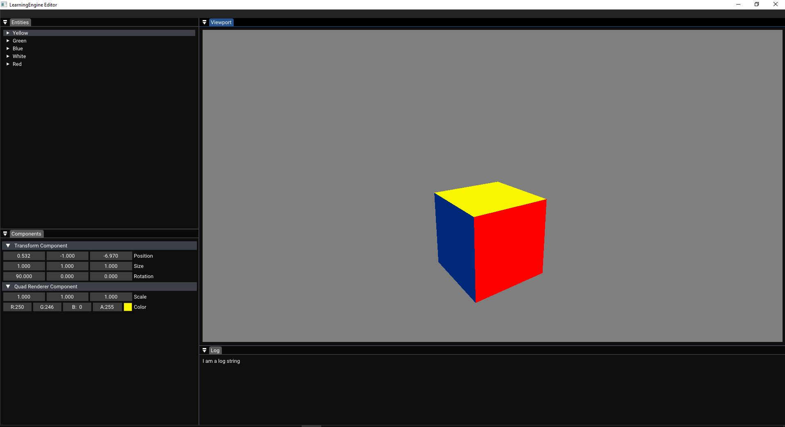
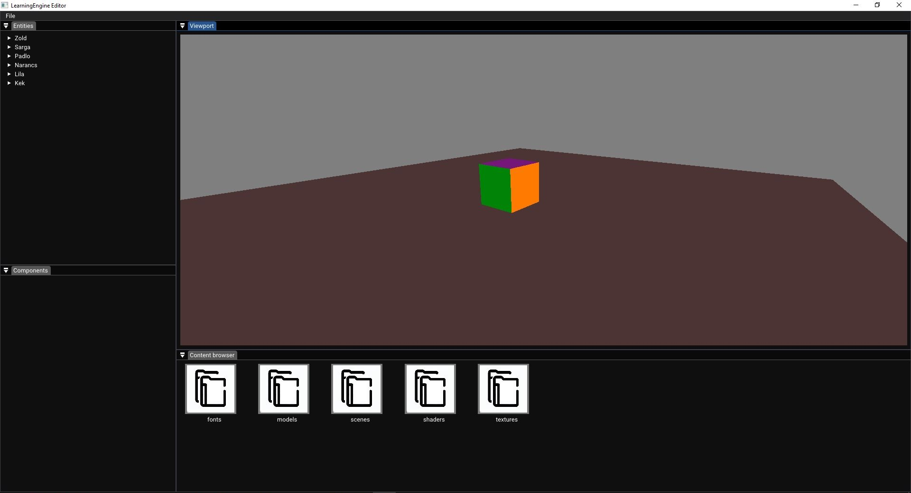

# LearningEngine

This is the more advanced version of my Engine which is being built for the reason for me to understand how Game Engines work and how to make them.
In this version i am planning to make it more like a Game Engine, i am going to add an Editor, make it perform faster and i am going to focus on 
3D. My plan is to make a Multiplayer game with this Engine. It will be a _long_, but **fun** journey.

## Images of the development
#### Images of the Editors early version with a 3D render made with it:
 

2023.05.25

  

2023.05.25

