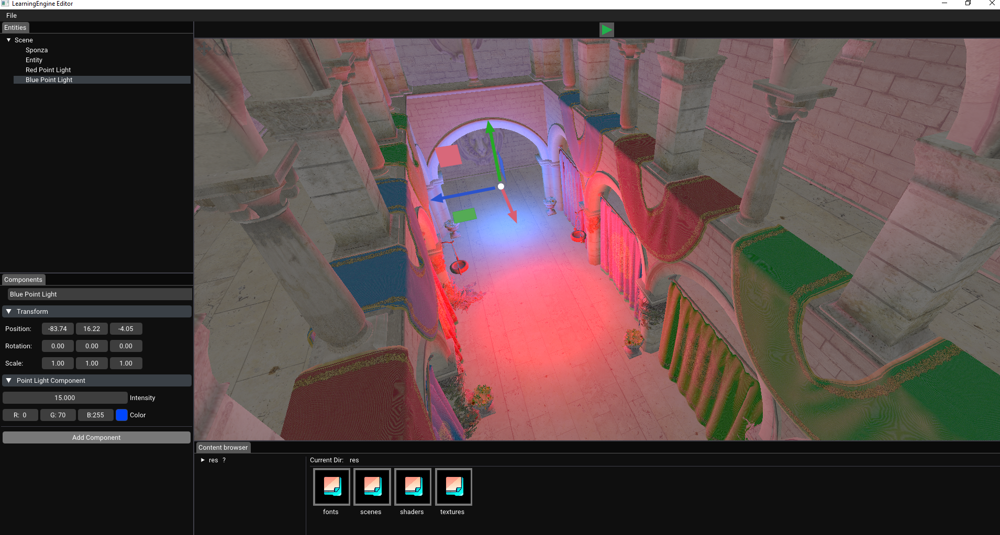
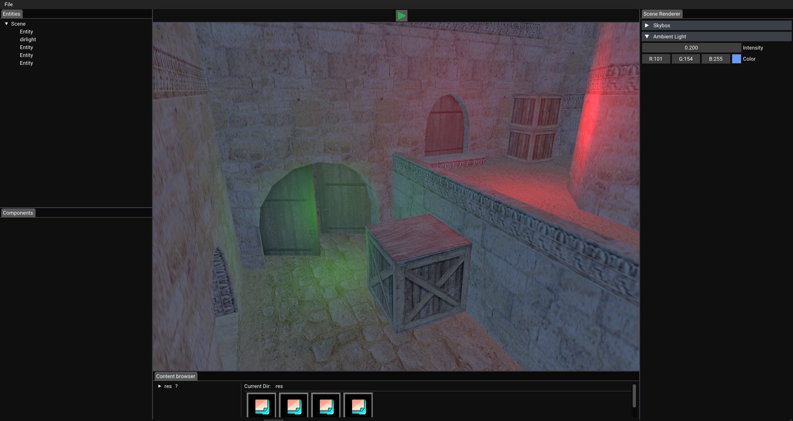

  
<h1 align="left">LearningEngine</h1>

This is the more advanced version of my Engine which is being built for the reason for me to understand how Game Engines work and how to make them.
In this version I am planning to make it more like a Game Engine, I am going to add an Editor, make it perform faster and I am going to focus on 
3D. My plan is to make a Multiplayer game with this Engine. It will be a _long_, but **fun** journey.

# Development Setup

LearningEngine is currently only set up for development on the **Windows** operating system in Visual Studio.

Clone the LearningEngine repository to your machine and run `scripts/Win-GenProjects.bat`. 
This will generate the solution files that you can open in Visual Studio. You'll then find LearningEngine.sln in the project root.

After opening the solution, Sandbox should be the active project by default, and pressing the play button in Visual Studio should open up a demo scene.

# Development Workflow

1. When you start a new task, create a new branch from _master_, and name it something relevant to the specific task you are working on so that other
developers can find it easily.

2. Pull master into your development branch regularly. If someone merges a change to a file you are actively working on, you will want to resolve any
conflicts as soon as you can.

3. Once you finish a task, create a merge request to merge your branch into master. In general, let at least one other developer review your code
before it is merged into master. Also, in general, strongly avoid merging any breaking changes into master that will slow or stop developers working
on other tasks (crashes, compilation errors, broken features, etc.).

By adhering to these 3 guidelines, we keep master stable enough to provide a good starting point for most new tasks, and we avoid having to deal with any 
broken or in-progress changes for unrelated tasks on our own development branches.

## Images of the development
#### Images of the Editors early version with a 3D render made with it:
 

2023.11.15

  

2023.11.15

